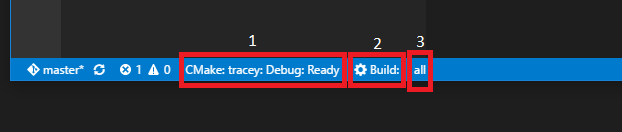
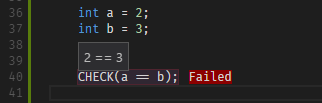

# CMake Tools

[CMake Tools](https://marketplace.visualstudio.com/items?itemName=vector-of-bool.cmake-tools) provides the native developer a full-featured, convenient, and
powerful configure+build workflow for CMake-based projects within the
Visual Studio Code editor.

This extension itself *does not* provide language support for the CMake
scripting language. For that I recommend [this extension](https://marketplace.visualstudio.com/items?itemName=twxs.cmake).

## What's New?

### **0.8.0**:
  - **Automatic Environment Selection**. CMake Tools will now automatically
    detect available build environments and let you select them using a
    quick-pick. This means *no more starting Code from a Visual Studio
    developer command prompt!* Currently supports Visual Studio 2013 and 2015
    for x86 and amd64. The environment chosen will be saved and persisted to the
    workspace.
  - Configuration options for the default build variants.
  - Configuration option for CTest command line arguments.
  - **0.8.1**: Fix deadlock on startup.
  - **0.8.2-4**: More fixes for environment loading.
  - **0.8.5**:
    - New `${workspaceRootFolderName}` available in config substitution.
    - New API exported for other extensions. See [here](https://github.com/vector-of-bool/vscode-cmake-tools/blob/develop/src/api.ts).
  - **0.8.6**: Tweaking output
  - **0.8.7**:
    - This version contains an enormous refactor of the codebase in preparation
      for CMake Server support. If you find _any_ issues or regressions from
      prior extension versions, **please** create an issue on the GitHub
      project.

## Issues? Questions? Feature requests?

**PLEASE**, if you experience any problems, have any questions, or have an idea
for a new feature, create an issue on [the GitHub page](https://github.com/vector-of-bool/vscode-cmake-tools)!

I'm only one person with no QA team, so I can't test all the different possible
configurations you may have, but I'll gladly help anyone fix issues relating to
this extension.

# Getting Started

CMake Tools provides several pieces of functionality to make it easier to work
with CMake-based projects within Visual Studio Code. For example, it adds a
"CMake: Build" command to the command palette, which is bound to the ``F7``
key by default.

By default, CMake Tools assumes that you place your CMake build tree in a
subdirectory of the source tree called ``build``. This can be configured with
the ``cmake.buildDirectory`` configuration option, which can be set globally or
on a per-project basis. If you try to build but do not yet have a build
directory, CMake Tools will prompt you to configure the project.

CMake Tools uses a configuration setting ``cmake.configureSettings`` to define
options to pass to CMake when configuring the project. In this way, build
settings can be stored as part of the project in ``settings.json`` in the
``.vscode`` directory.

## The Status bar

CMake Tools provides a few buttons on the statusbar:

1.  The name of the current project, the current build type (Debug, Release, etc.),
    and the current status of CMake Tools. Click this button to change the active
    configuration.
2.  A build button. Click this button to build the default target. Quickly invoking
    a build is also bound to the ``F7`` key by default. While building, this button
    changes into a _stop_ button. Clicking the stop button will cancel the
    currently running build/configure process.
3.  The default/active target. This is the target that will be invoked if run
    the build command. Clicking on this button will let you select a different
    target to be built by default.
4.  The Target Debugging launcher (must be explicitly enabled, se below).
5.  The active debug target (must be explicitly enabled).
6.  The CTest results button. Click this button to rebuild and run CTest tests.

CMake Tools will also show the most recent line of CMake output as a status message
to the right of the buttons. Invoking a command will open the CMake/Build output
channel, where the progress and output of the build/configure commands can be
seen.

## Target Debugging

*Target Debugging*, allows developers to easily use the Visual
Studio Code Debugger with their CMake targets without having to write a
``launch.json``. [Read about enabling and using the feature here](https://github.com/vector-of-bool/vscode-cmake-tools/blob/develop/docs/target_debugging.md).

## Compiler Diagnostics

CMake Tools also parses the compiler output of GCC, Clang, and MSVC looking for
diagnostics. It will populate the diagnostics for files which produce any warnings
or errors.

## CTest Tests

CMake Tools also features integration with CTest, both executing and displaying
results, even inline in the editor:

(Currently, only Catch test output is supported)

## Other Features

- Command to quickly generate a very basic CMakeLists.txt and C++ source file.
- Set CMake configuration values in ``settings.json``.
- Provides diagnostics for CMake scripts.
- Quickly jump into CMakeCache.txt
