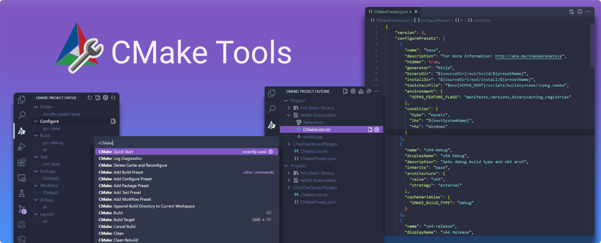
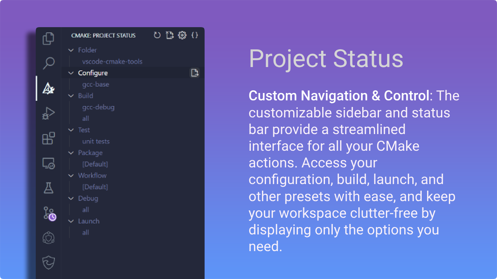

<head>
    <link rel="preconnect" href="https://fonts.googleapis.com">
    <link rel="preconnect" href="https://fonts.gstatic.com" crossorigin>
    <link href="https://fonts.googleapis.com/css2?family=Roboto:ital,wght@0,100..900;1,100..900&display=swap" rel="stylesheet">
</head>

<h1 align=center style="font-family: roboto; font-weight: 400">  CMake Tools </h1>

<i>Enhancing CMake development in VS Code.</i>

 

    
    
    
    

    
    
    

 

    

## Introduction
[CMake Tools](https://marketplace.visualstudio.com/items?itemName=ms-vscode.cmake-tools) provides the native developer a full-featured, convenient, and powerful workflow for CMake-based projects in Visual Studio Code.

 Features

    
    
    
    
    
    
    
        

## Setup and Installation
[Download CMake](https://cmake.org/download/) and add it to PATH.

TODO: Garrett could you fill anything else the user may need to know here?

Download the CMake Tools extension from the [VS Code Marketplace](https://marketplace.visualstudio.com/items?itemName=ms-vscode.cmake-tools).

## Resources
- [Docs](docs/README.md) for comprehensive documentation.
- [Quick Start](https://code.visualstudio.com/docs/cpp/CMake-linux) to get up and running fast.
- [Github](https://github.com/microsoft/vscode-cmake-tools) for source code, issues, and contributing.

## Contributing
We encourage an open and collaborative development environment and welcome all contributions. Whether you're fixing bugs, proposing new features, or improving our documentation - we invite you to join the CMake Tools community. Please review our [contribution guidelines](contributing.md) and adhere to our [code of conduct](https://opensource.microsoft.com/codeofconduct/).

You can also file issues with us using one of our templates:

[Bug Report](https://github.com/microsoft/vscode-cmake-tools/issues/new?template=bugreport.yml): For if you see an error message or encounter an issue while using the CMake Tools extension..

[Feature Request](https://github.com/microsoft/vscode-cmake-tools/issues/new?template=featurerequest.yml): For if you have a suggestion or need a feature that would enhance development.

[Documentation Request](https://github.com/microsoft/vscode-cmake-tools/issues/new?template=docrequest.yml): For requesting changes or additions to the [CMake Tools documentation](docs/README.md).

##

### Microsoft Open Source Code of Conduct

This project has adopted the [Microsoft Open Source Code of Conduct](https://opensource.microsoft.com/codeofconduct/). For more information see the [Code of Conduct FAQ](https://opensource.microsoft.com/codeofconduct/faq/) or contact opencode@microsoft.com with any additional questions or comments.

### Data/Telemetry

This extension collects usage data and sends it to Microsoft to help improve our products and services. Collection of telemetry is controlled via the same setting provided by Visual Studio Code: `"telemetry.enableTelemetry"`. Read our [privacy statement](https://privacy.microsoft.com/en-us/privacystatement) to learn more.

### Credits

This project was started by [@vector-of-bool](https://github.com/vector-of-bool) and is now currently maintained by Microsoft.

### Contributors

