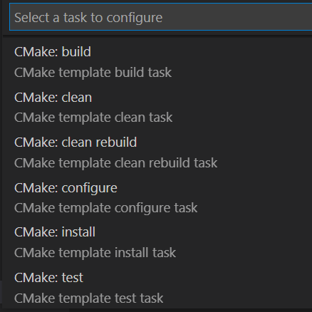

# Build with CMake Tools

Once you have [configured](configure.md) your project, you can run a CMake build. Most of your time with CMake Tools will be spent configuring the build. The build process is much simpler.

You can start a build by:

1. Running **CMake: Build** from the VS Code command pallette.
2. Pressing the keyboard shortcut (the default is `F7`).
3. Selecting the **Build** button in the VS Code status bar.

When the build starts, the CMake Tools output panel opens to display build tool output. The **Build** button will change to a **Stop** button, and may show a progress bar for the running build. Pressing the **Stop** button cancels the running build. Starting a build while another build is running will cancel the current build and start a new one.

> **Note:** The progress bar only displays if the build tool emits output lines that can be parsed to get a percentage of the build progress. This includes Ninja and Makefile generators. MSBuild does not emit this information, so no progress bar will be visible.

The results of the build are written to the directory specified by [cmake.buildDirectory](cmake-settings.md#cmake-settings). This defaults to a subdirectory of the project directory, so the build results are visible within the project explorer. The exact file paths will depend on your CMake project configuration.

## Build the default target

CMake Tools persists a "default target" for the build process. The default target is the "all" target (named `ALL_BUILD` in some generators), which builds all of the targets that CMake has designated for a default build.

The name of the default target is shown in the CMake Tools sidebar underneath the **Build** node:


Selecting this button shows a quick pick list for all the targets CMake Tools is aware of that can be built, along with the full path to the build result that will be generated by the target:


## Build a single target

You can build a single target without changing the current build target from the VS Code command palette by running the **CMake: Build Target** command, or by pressing the keyboard shortcut (default is `Shift+F7`). CMake will build any dependent targets, even if they aren't directly selected.

## Create a build task
You can also define a build task from the VS Code command palette by running the **Tasks: Configure Task** command.



By choosing the "CMake: build" task, the following task will be created in "${workspaceFolder}/.vscode/tasks.json" file.

```
{
    "version": "2.0.0",
    "tasks": [
        {
            "type": "cmake",
            "label": "CMake: build",
            "command": "build",
            "targets": [
                "ALL_BUILD"
            ],
            "group": "build",
            "problemMatcher": [],
            "detail": "CMake template build task"
        }
    ]
}
```

The default target is set to "all" target (named ALL_BUILD in some generators). You can modify the "targets" value with a single target or a list of targets that can be built. Here is an example of two customized build tasks in which the name of the task, the list of targets, and the description of the tasks is modified:

```
{
    "version": "2.0.0",
    "tasks": [
        {
            "type": "cmake",
            "label": "Sample CMake build task with single target",
            "command": "build",
            "targets": [
                "prj1"
            ],
            "group": "build",
            "problemMatcher": [],
            "detail": "Build task to build prj1"
        },
        {
            "type": "cmake",
            "label": "Sample CMake build task with multiple targets",
            "command": "build",
            "targets": [
                "prj1",
                "prj2"
            ],
            "group": "build",
            "problemMatcher": [],
            "detail": "Build task to build prj1 and prj2"
        }
    ]
}
```

Now you can run the build by running **Tasks: Run Build Task** from the VS Code command pallette. If there are other tasks defined in "tasks.json", the picker will show you the list of build tasks to choose from.


## How CMake Tools builds

### Build flags

CMake Tools builds by passing the `--build` flag to CMake. This flag is used as a generator-agnostic build invocation tool. CMake tools also passes `--config <build-type>`, based on the current build type from the active [variant](variants.md). This instructs multi-configuration build tools which configuration they should build.

For advanced scenarios, additional flags to `--build` can be set with [cmake.buildArgs](cmake-settings.md#cmake-settings), and additional flags for the underlying build tool can be set with [cmake.buildToolArgs](cmake-settings.md#cmake-settings).

### The build environment

Environment variables are inherited from the calling Visual Studio Code process, with additional variables from the [cmake.buildEnvironment](cmake-settings.md#cmake-settings) and [cmake.environment](cmake-settings.md#cmake-settings) settings.

If you are using a [Visual Studio Kit](kits.md#visual-Studio), CMake Tools runs the build with the appropriate environment variables set to build with the chosen version of Visual Studio, much like how it sets these environment variables during [the CMakeTools configure step](configure.md#the-cmake-tools-configure-step).

## Clean build

To clean the build, from the VS Code command pallette run the **CMake: Clean** command. Or run the **CMake: Clean rebuild** command to quickly delete any build results and run the build from scratch.

## Next steps

- Use CMake Tools to [launch and debug](debug-launch.md)
- Learn about [CMake settings](cmake-settings.md#cmake-settings) you can set to control the build.
- Explore the [CMake Tools documentation](README.md)
