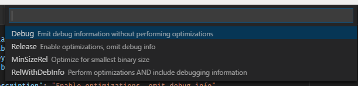
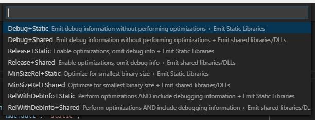

# Build Variants

Some build systems support build variants as a way to represent a commonly used
set of build settings and ways to mix and match them. ``cmake-variants.json``
(or a YAML variant, ``cmake-variants.yaml``) provides a way to encode a set of
project build settings to users in a way that is convenient, descriptive, and
easy to use. CMake Tools 0.6.0 features full support for working with variants
in this manner.

## ``cmake-variants.json``

The most important part of the system is ``cmake-variants.json``, which encodes
available build settings in such a way that they can be parsed and analyzed by
automated tooling, as well as human users. Here is the default variants
configuration used by CMake Tools when one is not present in a project directory:

~~~json
{
  "buildType": {
    "default$": "debug",
    "description$": "the build type to use",
    "debug": {
      "oneWordSummary$": "Debug",
      "description$": "Emit debug information without performing optimizations",
      "buildType": "Debug"
    },
    "release": {
      "oneWordSummary$": "Release",
      "description$": "Enable optimizations, omit debug info",
      "buildType": "Release"
    },
    "minsize": {
      "oneWordSummary$": "MinSizeRel",
      "description$": "Optimize for smallest binary size",
      "buildType": "MinSizeRel"
    },
    "reldeb": {
      "oneWordSummary$": "RelWithDebInfo",
      "description$": "Perform optimizations AND include debugging information",
      "buildType": "RelWithDebInfo"
    }
  }
}
~~~

This variants file simply exposes the four default CMake build type settings
available.

In Code, CMake Tools generates the following simple quick-pick when we ask to
change the build variant:

In short, the variants file specifies a set of _options_ and the corresponding
_values_ that they can assume. In the above example, there is one _option_
called ``buildType``. The inner keys describe the option and the values it can
assume. Special keys are suffixed by the ``$`` symbol, and are not valid
values for variant option. The special ``default$`` key specifies what the
default value for that option will be. The ``description$`` property will
describe what aspects of the build that the option controls.

All other properties are values available for that key. In the above example,
the values available for the ``buildType`` settings are ``debug``, ``release``,
``minsize``, and ``reldeb``. The values within this keys specify the effects of
choosing that specific value for the option. There are some pre-defined keys
that are valid in this location, specified below.

### Multiple Dimensions

Variants create a multi-dimensional array of possible build configurations. The
rank of the array will be the number of options available to be set. The size
of each dimension corresponds to the number of values that are available for
the corresponding option. The available variants are the cartesian product of
the options and their values. For example, we can add a ``linkage`` setting to
the above ``cmake-variants.json`` file:

~~~json
{
  "buildType": {
    /* ... */
  },
  "linkage": {
    "default$": "static",
    "description$": "The link usage of build libraries",
    "static": {
      "oneWordSummary$": "Static",
      "description$": "Emit Static Libraries",
      "linkage": "static"
    },
    "shared": {
      "oneWordSummary$": "Shared",
      "description$": "Emit shared libraries/DLLs",
      "linkage": "shared"
    }
  }
}
~~~

This creates a more complex quick-pick, containing each combination of build
type and link mode:

Automated tools can use this information to configure, build and analyze
projects in an exhaustive and thorough manner. Humans can read the file and get
a pretty good idea of what options are available to them.

## Available settings

Each value of a variant option can specify arbitrary build settings (meaning
that two values within an option don't need to be symmetrically or mutually
exclusive). When a set of options and corresponding valus are selected by a user
or tool, the resulting settings correspond to the result of merging the
settings specified in each chosen value. Here is a short listing of the settings
which can be provided:

- ``oneWordSummary$`` is a one-word summary of the value. This should be short and
  on-point. This is displayed to the user when a variant is given a name. Good
  examples might be "Debug", "Optimized", "DebugAssertions", "UseSuperAwefulHack",
  "UseExtremelySuperAwefulHack". *Bad* values might be "Emit debug symbols",
  "Link with shared libraries". Those should go in ``description$``.

- ``description$`` is a lengthier description about what a setting does. Users can
  inspect this value for more information about why they may or may not want
  to use the given value.

- ``buildType`` specifies what build type to use. This is the value passed for
  ``CMAKE_BUILD_TYPE`` and the ``--config`` option when invoking
  ``cmake --build``. **Note** that this should be preferred to setting
  ``CMAKE_BUILD_TYPE`` manually in the ``settings`` property (described below).

- ``linkage`` specifies what should be passed to CMake for
  [the BUILD_SHARED_LIBS option](https://cmake.org/cmake/help/latest/variable/BUILD_SHARED_LIBS.html),
  which *should be preferred* as the option to use for library projects which
  can be built as either static or shared/dynamic libraries.

- ``settings`` is the most expressive option: It specifies the exact values that
  are passed to CMake using the ``-D`` option. It should simply be a mapping of
  variable names and values that will be passed to CMake at configure time.
  *Note* that ``buildType``, ``linkage``, and other similar top-level options
  should be preferred to specifying their corresponding CMake options here.

  A quick example:

  ~~~json
  "settings": {
    "MY_CMAKE_CONFIG_OPTION": "Some Value",
    "RANDOM_NUMBER": 4,
  }
  ~~~

  This can be used to specify strings, numbers, boolean values, or string arrays.

- ``generator`` specifies what ``-G`` generator to use for configuring. Note
  that it is **not yet supported by CMake Tools**.

- ``toolset`` specifies what toolset to use with the ``-T`` option. Note that
  this option is **not yet supported by CMake Tools**.
