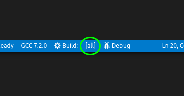

.. _building:

CMake Building
##############

Once you have :ref:`configured <configuring>` your project, you can run a CMake
build. Most work with CMake Tools will be done with configuring, and the build
process is much simpler.

Starting a build can be done in one of three ways:

#. Executing the *CMake: Build* command
#. Hitting the associated hotkey (the default being :kbd:`F7`).
#. Pressing the *Build* button in the status bar.

When the build starts, the CMake Tools output panel will be opened and the
output from the build tool will be shown as it runs. The *Build* button will
change to a *Stop* button and may show a progress bar for the running build.
Pressing the *Stop* button will cancel the running build. Attempting to execute
a build while a build is running will cancel the running build and start a new
one.

.. note::
    The progress bar will only be shown if the build tool emits output lines
    that can be parsed to contain a percentage of the build progress. This
    includes Ninja and Makefile generators. MSBuild does not emit this
    information, so no progress bar will be visible.

The results of the build will be written to the directory specified by
:ref:`conf-cmake.buildDirectory`. This default to a subdirectory of the project
directory, so the build results will be visible within the project explorer.
The exact file paths will depend on the CMake project configuration.

.. _building.default-target:

The Default Target
******************

CMake Tools persists a "default target" for the build process. The default
target is the "all" target (named ``ALL_BUILD`` in some generators), which will
build all targets CMake has designated for a default build.

The name of the default target is shown in the status bar to the right of the
*Build* button in square brackets:

Clicking this button will show a quick-pick for all the target CMake Tools is
aware of that can be built, along with the full path to the build result that
will be generated by the target:

.. image:: res/target_selector.png
    :align: center

.. _building.single-target:

Building a Single Target
************************

Instead of changing the build target, one can also request to build a single
target a single time. Run the *CMake: Build a target* command, or hit the
associated hotkey (defaults to :kbd:`Shift+F7`).

.. note::
    CMake will build dependent targets, even if they aren't directly selected.

.. _building.how:

How CMake Tools Builds
**********************

Build Flags
===========

CMake Tools builds using the ``--build`` flag to CMake. This flag is used as
a generator-agnostic build invocation tool. CMake tools also passes
``--config <build-type>`` based on the current build type from the active
:ref:`variant <variants>`. This instructs multi-conf build tools on what
configuration they should build.

Additional flags to ``--build`` can be set with :ref:`conf-cmake.buildArgs`,
and additional flags for the underlying build tool can be set with
:ref:`conf-cmake.buildToolArgs`. These are advanced options and should only be
used if you know what you are doing.

The Build Environment
=====================

Environment variables will be inherited from the calling Visual Studio Code
process, with additional variables from the :ref:`conf-cmake.buildEnvironment`
and :ref:`conf-cmake.environment` setting.

If using a :ref:`Visual Studio Kit <kits.types.vs>`, CMake Tools runs the build
with the appropriate environment variables set to build with the chosen
Visual Studio, much like how it sets these environment variables when
:ref:`configuring <configuring.how>`.

Cleaning Up
***********

CMake Tools lets you clean the build output by running the *CMake: Clean*
command. One can also run the *CMake: Clean rebuild* to quickly delete build
results and run the build from scratch.