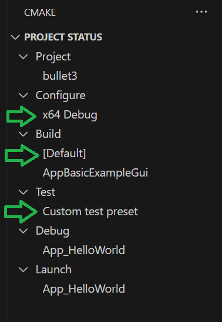

# Configure and build with CMake Presets in Visual Studio Code

CMake supports two files that allow users to specify common configure, build, and test options and share them with others: `CMakePresets.json` and `CMakeUserPresets.json`. You can use these files to drive CMake in Visual Studio and Visual Studio Code, in a continuous integration (CI) pipeline, and from the command line.

`CMakePresets.json` is for saving project-wide builds. `CMakeUserPresets.json` is for developers to save their own local builds. Their integration is available in CMake Tools version 1.7 and later.

This article contains information about `CMakePresets.json` integration in the CMake Tools extension for Visual Studio Code. Here are helpful links:
- For more information on the format of `CMakePresets.json`, see the official [CMake documentation](https://cmake.org/cmake/help/latest/manual/cmake-presets.7.html).
- For more information on the Microsoft vendor maps and macro expansion, see [`CMakePresets.json` and `CMakeUserPresets.json` Microsoft vendor maps](https://docs.microsoft.com/cpp/build/cmake-presets-json-reference).
- For more information on how to use `CMakePresets.json` in Visual Studio, see [Configure and build with CMake Presets in Visual Studio](https://docs.microsoft.com/cpp/build/cmake-presets-vs).

We recommend `CMakePresets.json` as an alternative to kits and variants files. To enable or disable `CMakePresets.json` integration in the CMake Tools extension, see [Enable `CMakePresets.json` in the CMake Tools extension](#enable-cmakepresetsjson-in-the-cmake-tools-extension).

## Supported CMake and `CMakePresets.json` versions

The CMake Tools extension supports version 2 or later for the `CMakePresets.json` and `CMakeUserPresets.json` files. You can update your file version by incrementing the version field in the root object. For an example and more information, see [`CMakePresets.json`](https://cmake.org/cmake/help/latest/manual/cmake-presets.7.html#format).

CMake version 3.20 or later is required when you're invoking CMake with `CMakePresets.json` (version 2 or later) from the command line. CMake Tools reads and evaluates `CMakePresets.json` and `CMakeUserPresets.json`. It doesn't invoke CMake directly with the `--preset` option. So, CMake version 3.20 or later isn't strictly required when you're building with `CMakePresets.json` inside Visual Studio Code. We recommend using CMake version 3.14 or later.

## Enable `CMakePresets.json` in the CMake Tools extension

A new setting, `cmake.useCMakePresets`, has been added to `settings.json`:

|Setting  |Description  |Accepted values  | Default value |
|---------|---------|---------|---------|
|`cmake.useCMakePresets` | Use `CMakePresets.json` to drive CMake configure, build, and test | `always`, `never`, `auto` | `auto` |

The `auto` value evaluates to `always` if there's a `CMakePresets.json` file in `cmake.sourceDirectory` for the active folder. It evaluates to `never` if there's no `CMakePresets.json` file in `cmake.sourceDirectory` for the active folder. Set `cmake.useCMakePresets` to `always` or `never` to explicitly enable or disable `CMakePresets.json` integration for all CMake projects.

## Configure and build

You can configure and build your CMake project by using a series of commands. Open the command palette in Visual Studio Code with `Ctrl+Shift+P`:


### CMake: Select Configure Preset

**CMake: Select Configure Preset** lists the union of non-hidden Configure Presets defined in `CMakePresets.json` and `CMakeUserPresets.json`. Select a Configure Preset to make it the active Configure Preset. This is the `configurePreset` value that's used when CMake is invoked to generate the project build system. The active Configure Preset appears in the Project Status View on the CMake Tools sidebar.

CMake Tools uses the value of `hostOS` in the Microsoft Visual Studio Settings vendor map to hide Configure Presets that don't apply to your platform. For more information, see the entry for `hostOS` in the table under [Visual Studio Settings vendor map](https://docs.microsoft.com/cpp/build/cmake-presets-json-reference#visual-studio-settings-vendor-map).

### CMake: Configure

To configure the project, run **CMake: Configure** from the command palette. This is the same as running `cmake --preset <configurePreset>` from the command line, where `<configurePreset>` is the name of the active Configure Preset.

> [!NOTE]
> If you're a windows developer, you must open Visual Studio Code from a developer command prompt. Or, run the **CMake: Scan for Compilers** command before the CMake Tools extension can detect build tools (CMake, Ninja) that are installed with Visual Studio.

### CMake: Select Build Preset

**CMake: Select Build Preset** lists the Default Build Preset and the union of non-hidden Build Presets defined in `CMakePresets.json` and `CMakeUserPresets.json`. The Default Build Preset is equivalent to passing `cmake --build` with no additional arguments from the command line. Select a Build Preset to make it the active Build Preset. This is the `buildPreset` value that's used when CMake is invoked to build the project. The active Build Preset is displayed in the Project Status View on the CMake Tools sidebar.

All Build Presets must specify an associated `configurePreset` value. CMake Tools hides Build Presets that don't apply to the active Configure Preset. For more information, see the [list of Build Presets](https://cmake.org/cmake/help/latest/manual/cmake-presets.7.html#build-preset).

### CMake: Build

Run **CMake: Build** from the command palette to build the entire project. This is the same as running `cmake --build --preset <buildPreset>` from the command line, where `<buildPreset>` should be replaced by the name of the active Build Preset.

Run **CMake: Build Target** from the command palette to build a single target with the instructions encoded in the active Build Preset.

## Test

CTest is the CMake test driver program and is integrated with the CMake Tools extension. For more information, see the [CTest documentation](https://cmake.org/cmake/help/latest/manual/ctest.1.html#ctest-1).

### CMake: Select Test Preset

**CMake: Select Test Preset** lists the default Test Preset and the union of non-hidden Test Presets defined in `CMakePresets.json` and `CMakeUserPresets.json`. The default Test Preset is the same as invoking `ctest` with no other arguments from the command line.

Select a Test Preset to make it the active Test Preset. This is the `testPreset` value that will be used when you invoke CTest to run tests. The active Test Preset appears in the Project Status View on the CMake Tools sidebar.

All Test Presets must specify an associated `configurePreset` value. CMake Tools will hide Test Presets that don't apply to the active Configure Preset. For more information, see the [list of Test Presets](https://cmake.org/cmake/help/latest/manual/cmake-presets.7.html#test-preset).

### CMake: Run Tests

To invoke CTest, run **CMake: Run Tests** from the command palette. 
When integration with the test explorer is enabled, using `cmake.ctest.testExplorerIntegrationEnabled`, the method of test execution will depend on `cmake.ctest.allowParallelJobs`. With `cmake.ctest.allowParallelJobs` disabled, each test will be run individually so that we can accurately track progress in the Test Explorer. When it is enabled, they will all be run in parallel, which is the same as running `ctest --preset <testPreset>` from the command line, where `<testPreset>` is the name of the active Test Preset.

### CMake Tools side bar Project Status View behavior

The CMake Tools Project Status View in the sidebar displays the active Configure Preset, Build Preset, and Test Preset under their respective Configure, Build, and Test Nodes. You can select each option to change the active preset:



To show or hide individual status bar icons, you can modify `cmake.options.advanced` in `settings.json`. For more information on how to configure your view, please see our [CMake view configuration docs](cmake-options-configuration.md)

## Add new presets

All commands and preset templates modify `CMakePresets.json`. You can add new user-level presets by directly editing `CMakeUserPresets.json`.
Use forward slashes (`/`) for paths in `CMakePresets.json` and `CMakeUserPresets.json`.

### Add new Configure Presets

To add a new Configure Preset to `CMakePresets.json`, run the **CMake: Add Configure Preset** command. This command lists several Configure Preset templates, along with a **[Scan for Compilers]** option in the command palette. **[Scan for Compilers]** returns all of the GCC and Clang compilers on your `PATH`, all compilers found in `cmake.additionalCompilerSearchDirs` and `cmake.emscriptenSearchDirs`, and the latest instances of `cl.exe` installed with Visual Studio.


 - Select **Inherit from Configure Preset** to inherit from an existing Configure Preset. For more information about inheritance, see the [list of Configure Presets](https://cmake.org/cmake/help/latest/manual/cmake-presets.7.html#configure-preset).
 - Select the **Toolchain File** template to configure your CMake project with a CMake toolchain file.
 - Select the **Custom** template to configure an empty Configure Preset.
 - Select **[Scan for Compilers]** to search for C/C++ compilers on your machine.

The selected template will be added to `CMakePresets.json` if `CMakePresets.json` exists. Otherwise, the template will be copied into a new `CMakePresets.json` file. For more information on editing Configure Presets, see [Edit presets](#edit-presets).

> [!NOTE]
> CMake Tools selects the most recent version of `cl.exe` installed by default. If you're a Windows developer, you can specify a compiler version with the `toolset` option in `CMakePresets.json`. For more information, see the [list of Configure Presets](https://cmake.org/cmake/help/latest/manual/cmake-presets.7.html#configure-preset) and [Toolset Selection](https://cmake.org/cmake/help/latest/generator/Visual%20Studio%2016%202019.html#toolset-selection).

### Add new Build Presets

To add a new Build Preset to `CMakePresets.json`, run the **CMake: Add Build Preset** command. This command lists several Build Preset templates in the command palette:

- Select **Create from Configure Preset** to display a list of `configurePresets` values defined in `CMakePresets.json`. After you select a Configure Preset, an empty Build Preset associated with the selected Configure Preset will be created.
- Select **Inherit from Build Preset** to display a list of `buildPresets` values defined in `CMakePresets.json`. After you select a Build Preset, a new Build Preset that inherits from the selected Build Preset will be created.
- Select **Custom** to configure an empty Build Preset.

For more information on editing Build Presets, see the [list of Build Presets](https://cmake.org/cmake/help/latest/manual/cmake-presets.7.html#build-preset).

### Add new Test Presets

To add a new Test Preset to `CMakePresets.json`, run the **CMake: Add Test Preset** command. This command lists several Test Preset templates in the command palette:
- Select **Create from Configure Preset** to display a list of `configurePresets` values defined in `CMakePresets.json`. After you select a Configure Preset, an empty Test Preset associated with the selected Configure Preset will be created.
- Select **Inherit from Test Preset** to display a list of `testPresets` values defined in `CMakePresets.json`. After you select a Test Preset, a new Test Preset that inherits from the selected Test Preset will be created.
- Select the **Custom** template to configure an empty Test Preset.
For more information about editing Test Presets, see the [list of Test Presets](https://cmake.org/cmake/help/latest/manual/cmake-presets.7.html#test-preset).

## Edit presets

The official [CMake documentation](https://cmake.org/cmake/help/latest/manual/cmake-presets.7.html#id1) is the best resource for editing Configure Presets, Build Presets, and Test Presets. The following information is a subset of the CMake documentation that covers common actions.

### Select your compilers

You can set C and C++ compilers with `cacheVariables.CMAKE_C_COMPILER` and `cacheVariables.CMAKE_CXX_COMPILER` in a Configure Preset. This is equivalent to passing `-D CMAKE_C_COMPILER=<value> and -D CMAKE_CXX_COMPILER=<value>` to CMake from the command line. For more information, see [`CMAKE_<LANG>_COMPILER`](https://cmake.org/cmake/help/latest/variable/CMAKE_LANG_COMPILER.html#cmake-lang-compiler).

You can specify the name of a compiler on your `PATH` instance or an environment variable that evaluates to the full path of a compiler. Full paths are discouraged so that the file will remain shareable.

When you build with the Visual C++ toolset, CMake Tools automatically sources the environment from the latest version of the Visual Studio Build Tools installed on your system. You can specify a compiler version with the `toolset` option in `CMakePresets.json`. For more information, see [Configure Presets and Toolset Selection](https://cmake.org/cmake/help/latest/manual/cmake-toolchains.7.html).

A preset that builds for 64-bit Windows with `cl.exe` and a Visual Studio Generator might set compilers like this:

```json
"architecture": {
   "value": "x64",
   "strategy": "set"
},
"cacheVariables": {
   "CMAKE_BUILD_TYPE": "Debug",
   "CMAKE_C_COMPILER": "cl",
   "CMAKE_CXX_COMPILER": "cl",
   "CMAKE_INSTALL_PREFIX": "${sourceDir}/out/install/${presetName}"
 },
 ```

A preset that builds with GCC version 8 on Linux or macOS might set compilers like this:

```json
"cacheVariables": {
    "CMAKE_BUILD_TYPE": "Debug",
    "CMAKE_INSTALL_PREFIX": "${sourceDir}/out/install/${presetName}",
    "CMAKE_C_COMPILER": "gcc-8",
    "CMAKE_CXX_COMPILER": "g++-8"
}
```

You can also set compilers with a CMake toolchain file. Toolchain files can be set with `cacheVariables.CMAKE_TOOLCHAIN_FILE`, which is equivalent to passing `-D CMAKE_TOOLCHAIN_FILE=<value>` to CMake from the command line. A CMake toolchain file is most often used for cross-compilation. For more information on authoring CMake toolchain files, see [CMake toolchains](https://cmake.org/cmake/help/latest/manual/cmake-toolchains.7.html).

### Select your generator

Configure Preset templates default to the Visual Studio Generator on Windows, and Ninja on Linux and macOS. You can specify a new generator with the `generator` option in a Configure Preset. This is equivalent to passing `-G` to CMake from the command line. For more information, see [CMake generators](https://cmake.org/cmake/help/latest/manual/cmake-generators.7.html#:~:text=A%20CMake%20Generator%20is%20responsible%20for%20writing%20the,what%20native%20build%20system%20is%20to%20be%20used).

> [!NOTE]
> If you're a Windows developer, be sure to set `architecture.strategy` and `toolset.strategy` to `external` when you're building with a command-line generator like Ninja on Windows.

### Set and reference environment variables

You can set environment variables by using the environment map. Environment variables are inherited through the `inherits` field, but you can override them as desired. A preset's environment will be the union of its own environment and the environment from all its parents.

If multiple `inherits` presets provide conflicting values for the same variable, the earlier preset in the `inherits` list will be preferred. You can unset a variable inherited from another preset by setting it to `null`.

Environment variables set in a Configure Preset also automatically flow to associated Build Presets and Test Presets, unless `inheritConfigureEnvironment` is set to `false`. For more information, see the [list of Configure Presets](https://cmake.org/cmake/help/latest/manual/cmake-presets.7.html#configure-preset).

You can reference environment variables by using the `$env{<variable-name>}` and `$penv{<variable-name>}` syntax. For more information, see [Macro Expansion](https://cmake.org/cmake/help/latest/manual/cmake-presets.7.html#macro-expansion).

### Select your target and host architecture when building with the Visual C++ toolset

The target architecture (x64, Win32, ARM64, or ARM) can be set with `architecture.value`. This is equivalent to passing `-A` to CMake from the command line. For more information, see [Platform Selection](https://cmake.org/cmake/help/latest/generator/Visual%20Studio%2016%202019.html#platform-selection).

> [!Note]
> Currently, Visual Studio Generators expect the Win32 syntax and command-line generators (like Ninja) expect the x86 syntax when you're building for x86.

You can set the host architecture (x64 or x86) and toolset by using `toolset.value`. This is equivalent to passing `-T` to CMake from the command line. For more information, see [Toolset Selection](https://cmake.org/cmake/help/latest/generator/Visual%20Studio%2016%202019.html#toolset-selection).

`architecture.strategy` and `toolset.strategy` tell CMake how to handle the `architecture` and `toolset` fields:

- `set` means CMake will set the respective value. It should be used with IDE generators like the Visual Studio Generator.
- `external` means CMake will not set the respective value. It should be used with command-line generators like Ninja.

Vendors like Visual Studio can then source the required environment before CMake is invoked. For more information about the `architecture` and `toolset` fields, see the [list of Configure Presets](https://cmake.org/cmake/help/latest/manual/cmake-presets.7.html#configure-preset).

For a full list of IDE generators that support the `architecture` field, see [`CMAKE_GENERATOR_PLATFORM`](https://cmake.org/cmake/help/latest/variable/CMAKE_GENERATOR_PLATFORM.html). For a full list of IDE generators that support the `toolset` field, see [`CMAKE_GENERATOR_TOOLSET`](https://cmake.org/cmake/help/latest/variable/CMAKE_GENERATOR_TOOLSET.html).

## Enable Vcpkg integration

Vcpkg helps you manage C and C++ libraries on Windows, Linux, and macOS. A vcpkg toolchain file (`vcpkg.cmake`) must be passed to CMake to enable vcpkg integration. For more information, see the [vcpkg documentation](https://github.com/microsoft/vcpkg#vcpkg-overview).

Set the path to `vcpkg.cmake` with the `VCPKG_ROOT` environment variable in `CMakePresets.json`:

```json
"cacheVariables": {
   "CMAKE_TOOLCHAIN_FILE": {
      "value": "$env{VCPKG_ROOT}/scripts/buildsystems/vcpkg.cmake",
       "type": "FILEPATH"
    }
 },
```

`VCPKG_ROOT` should be set to the root of your vcpkg installation. For more information, see [vcpkg environment variables](https://github.com/microsoft/vcpkg/blob/master/docs/users/config-environment.md).

If you're already using a CMake toolchain file and want to enable vcpkg integration, see [Using multiple toolchain files](https://github.com/microsoft/vcpkg/blob/master/docs/users/integration.md#using-multiple-toolchain-files). Follow those instructions to use an external toolchain file with a project by using vcpkg.

## Substitute commands in `launch.json` and `settings.json`

CMake Tools supports command substitution for launch commands when `CMakePresets.json` integration is enabled. For more information, see [Command substitution](https://github.com/microsoft/vscode-cmake-tools/blob/main/docs/cmake-settings.md#command-substitution).

## Ignored settings

`CMakePresets.json` should be the source of truth for all settings related to configure, build, and test, except for settings that can be used as temporary overrides (see below). This eliminates behavior specific to Visual Studio Code and ensures that your CMake and CTest invocations can be reproduced from the command line. 

The following settings in `settings.json` either duplicate options in `CMakePresets.json` or no longer apply. These settings will be ignored when `CMakePresets.json` integration is enabled.

| Ignored setting in `settings.json` | `CMakePresets.json` equivalent |
|--|--|
| `cmake.buildDirectory` | `configurePresets.binaryDir` |
| `cmake.configureSettings` | `configurePresets.cacheVariables` |
| `cmake.ctestParallelJobs` | `testPresets.execution.jobs` |
| `cmake.ctestArgs` | Various options in `testPreset` |
| `cmake.defaultVariants` | Doesn't apply |
| `cmake.environment` | `configurePresets.environment` |
| `cmake.generator` | `configurePresets.generator` |
| `cmake.ignoreKitEnv` | Doesn't apply |
| `cmake.installPrefix` | `configurePresets.cacheVariables.CMAKE_INSTALL_PREFIX` |
| `cmake.parallelJobs` | `buildPresets.jobs` |
| `cmake.platform` | `configurePresets.architecture` |
| `cmake.preferredGenerators` | `configurePresets.generator` |
| `cmake.setBuildTypeOnMultiConfig` | `configurePresets.cacheVariables.CMAKE_BUILD_TYPE` |
| `cmake.toolset` | `configurePresets.toolset` |

## Settings that can be used to override CMakePresets.json settings for temporary testing

The following settings can be used temporarily when CMakePresets integration is enabled.

| Setting in `settings.json` | `CMakePresets.json` equivalent |
|--|--|
| `cmake.buildArgs` | Various options in `buildPreset` |
| `cmake.buildEnvironment` | `buildPresets.environment` |
| `cmake.buildToolsArgs` | `buildPresets.nativeToolOptions` |
| `cmake.configureArgs` | Various options in `configurePreset` |
| `cmake.configureEnvironment` | `configurePresets.environment` |
| `cmake.testEnvironment` | `testPresets.environment` |

## Unsupported commands

The following commands are not supported when `CMakePresets.json` integration is enabled:
- **CMake: Quick Start**
- **CMake: Select Variant**
- **CMake: Scan for Kits**
- **CMake: Select a Kit**
- **CMake: Edit User-Local CMake Kits**

## Troubleshoot

If things aren't working as expected, you can try a few troubleshooting steps.

If either `CMakePresets.json` or `CMakeUserPresets.json` is invalid, none of the presets in the invalid file will be available for selection. CMake Tools IntelliSense can help you catch many of these JSON errors, but it won't know if you're referencing a preset with `inherits` or `configurePreset` by the wrong name.

To check if your preset files are valid, run `cmake --list-presets` from the command line at the root of your project directory. (CMake 3.20 or later is required.) If either file is invalid, you'll see the following error:

```DOS
CMake Error: Could not read presets from
C:/Users/<user>/source/repos/<project-name>: JSON parse error
```

If you're working on Windows, CMake must be on `PATH`.

Other troubleshooting steps include:

- Confirm that `cmake.exe` and your generator are installed and on `PATH`. If you're working on Windows, run the **CMake: Scan for Compilers** command so the extension can detect build tools installed with Visual Studio.
- Delete the cache and reconfigure the project (**CMake: Delete Cache and Reconfigure**).
- Reset the CMake Tools extension state (**CMake: Reset CMake Tools Extension State**).
- Increase the logging level (`cmake.loggingLevel` in `settings.json`) and/or check the log file (**CMake: Open the CMake Tools Log File**).

If you identify a problem, the best way to report it is by submitting an issue to the [CMake Tools extension repository](https://github.com/microsoft/vscode-cmake-tools).

## Run CMake from the command line or a CI pipeline

You can use the same `CMakePresets.json` and `CMakeUserPresets.json` files to invoke CMake in Visual Studio Code, and from the command line. The [CMake](https://cmake.org/cmake/help/latest/manual/cmake.1.html) and [CTest](https://cmake.org/cmake/help/latest/manual/ctest.1.html) documentation are the best resources for invoking CMake and CTest with `--preset`. CMake version 3.20 or later is required.

You can run the following commands from the directory where your `CMakePresets.json` file is located:

```DOS
cmake --list-presets=all .
cmake --preset <configurePreset-name>
cmake --build --preset <buildPreset-name>
ctest --preset <testPreset-name>
```

For information on building with a command-line generator on Windows, see [Sourcing the environment when building with command-line generators on Windows](https://docs.microsoft.com/cpp/build/cmake-presets-vs#sourcing-the-environment-when-building-with-command-line-generators-on-windows).

## Example `CMakePresets.json` file

See the `CMakePresets.json` file checked in the [box2d-lite](https://github.com/esweet431/box2d-lite/blob/vs-launch/CMakePresets.json) code sample. It contains examples of Configure Presets, Build Presets, and Test Presets.

## Next steps

- Review [How CMake Tools builds](build.md#how-cmake-tools-builds).
- Explore the [CMake Tools documentation](README.md).
