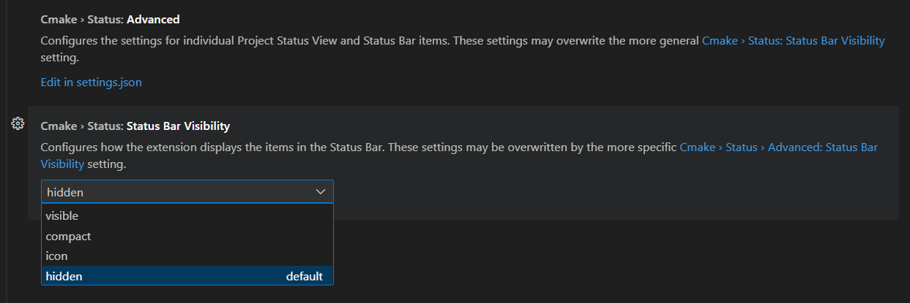
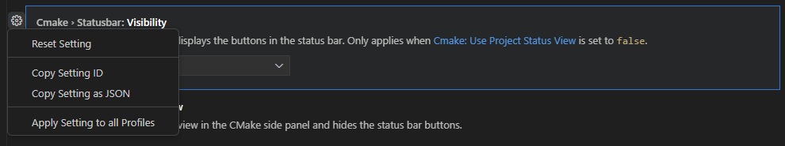

# CMake Project Outline View

Starting in CMake Tools 1.16, we will provide users the ability to customize their status bar with related CMake items like presets, kits, variants, build, configure, and launch to allow for users to de-clutter this global status bar as much as they would like to, while also having quick access to commonly performed CMake actions.

Users can specify what is shown in the status bar through their `settings.json` file.

The default settings will be set to the following:
## Default Settings Json
```json
"cmake.status.statusBarVisibility": "hidden"

"cmake.status.advanced": {
    "build": {
        "statusBarVisibility": "visible"
    },

    "launch": {
        "statusBarVisibility": "visible"
    },

    "debug": {
        "statusBarVisibility" :"visible"
    }
}
```

These settings mean that by default all settings will be hidden from the status bar, except for Build, Launch, and Debug actions.

To revert to the prior experience and have all of your presets display in the status bar, set your `Cmake > StatusBar: Visibility` setting to `Visible`


## Configuring your CMake Status Bar

 You can configure settings for each of the following CMake actions in your settings.json to either be `visible` or `hidden` in the status bar through the `statusBarVisibility` variable.  Settings that are available to be hidden from the project status view side bar can be configured to be `visible` or `hidden` through the `projectStatusVisibility` variable.
 
To make options visible in the status bar take up less space, you can configure certain options to be only the respective icon through the `icon` option in `statusBarVisibility` or specify a given character length through the `compact` option in `statusBarVisibility`. If a `statusBarVisibility` option is set to `compact` you can then specify an integer length for how many characters you want an option to take up through the `statusBarLength` option. It will truncate your existing status bar option to that specified character length. The default option is 20 characters
 
The full level of options for the CMake status can be seen below:

### CMake Status Bar Configuration Options in your Settings Json
```json
"cmake.status.statusBarVisibility": "visibile", "icon", "compact", "hidden" 
"cmake.status.advanced": { 

        "folder": { 
        	"statusBarVisibility": "visible", "icon", "compact", "hidden" 
            "statusBarLength": 20
            "projectStatusVisibility": "visible", "hidden" 
        }, 
        "configure": { 
            	"projectStatusVisibility": "visible", "hidden" 
        }, 
        "configurePreset": { 
            	"statusBarVisibility": "visible", "icon", "compact", "hidden" 
            	"statusBarLength": 20
        }, 
        "kit": { 
            	"statusBarVisibility": "visible", "icon", "compact", "hidden" 
            	"statusBarLength": 20 
        }, 
        "variantStatus": { 
            	"statusBarVisibility": "visible", "icon", "compact", "hidden" 
        }, 
        "build": { 
            	"statusBarVisibility": "visible", "icon", "hidden" 
            	"projectStatusVisibility": "visible", "hidden" 
        }, 
        "buildPreset": { 
            	"statusBarVisibility": "visible", "icon", "compact", "hidden" 
            	"statusBarLength": 20 
        }, 
        "buildTarget": { 
            	"statusBarVisibility": "visible", "compact", "hidden" 
            	"statusBarLength": 20 
        }, 
        "ctest": { 
            	"statusBarVisibility": "visible", "icon", "compact", "hidden" 
            	"statusBarLength": 20 
            	"color": true, false 
            	"projectStatusVisibility": "visible", "hidden" 
        }, 
        "testPreset": { 
            	"statusBarVisibility": "visible", "icon", "compact", "hidden" 
            	"statusBarLength": 20
        },
        "launchTarget": { 
            	"statusBarVisibility": "visible", "compact", "hidden" 
            	"statusBarLength": 20 
        }, 
        "debug": { 
            	"statusBarVisibility": "visible", "hidden" 
            	"projectStatusVisibility": "visible", "hidden" 
        },
        "launch": { 
            	"statusBarVisibility": "visible", "hidden" 
            	"projectStatusVisibility": "visible", "hidden" 
        }
}
```

* `folder` is the active folder in your workspace. This is where the project is scoped to.
* `configure` is associated with the CMake Configure action. It can only be found in the Project Status View and can't be seen in the status bar, hence no `statusBarVisibility` property value
* `configurePreset` is associated with the CMake Configure Preset. When selected, the user can modify their active CMake Configure Preset from the list detected in their CMakePresets.json and CMakeUserPresets.json (if found in project)
* `kit` is associated with the active kit selected (when CMake Presets aren't present). When selected, the user can modify their active kit. To learn more about kits, please see [our kit documentation](https://github.com/microsoft/vscode-cmake-tools/docs/kits.md)
* `variantStatus` is associated with the active variant status (when CMake Presets aren't present). When selected, the user can modify their active variant. To learn more about variants, please see [our variant documentation](https://github.com/microsoft/vscode-cmake-tools/docs/variants.md)
* `build` is associated with the CMake Build action. It invokes a CMake build on your build target using your build preset or variant.
* `buildPreset` is associated with your active CMake Build Preset. When selected, the user can modify their active CMake Build Preset from the list detected in their CMakePresets.json and CMakeUserPresets.json (if found in project)
* `buildTarget` is associated with your active CMake Build Target. When selected, the user can specify their active Build Target. This will be the target invoked when the user presses the `Build` icon in the status bar (if not hidden) or runs `CMake: Build Target` from the Command Palette
* `ctest` is associated with running CTest. When selected, it will invoke CTest on the test preset specified. If there is no test preset specified, it will run all your tests by default.
* `testPreset` is associated with selecting your active CMake Test Preset. When selected, the user can modify their active CMake Test Preset from the list detected in their CMakePresets.json and CMakeUserPresets.json (if found in project)
* `launchTarget` is associated with selecting your active launch target. When selected, you can specify the active launch target.
* `debug` is associated with the CMake Debug action. It invokes a debugger on the active launch target.
* `launch` is associated with launching the target. It will run the specified target application in the terminal.

To reset your CMake options back to the default, hover over your `CMake > Statusbar: Visibility setting` and select `Reset Setting`

