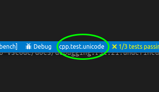

# CMake: Debug and launch

CMake Tools makes it easier to set up debugging. Because C and C++ projects may define multiple (sometimes dozens or even hundreds) of executables, creating a `launch.json` may be difficult.

If you define any executable targets via CMake, CMake Tools will be aware of them and allow you to start debugging them.

> **Note:**
> Debugging is supported when CMake is using either _CMake Server_ or the cmake-file-api. These modes are enabled automatically for CMake versions 3.7.2 and above. Debugging is not available on older versions.

If you are running an older version of CMake and want to use target debugging, update your CMake version to version 3.7.2 or higher.

By default, launching or debugging an executable target causes it to be built first. This can be disabled with the [cmake.buildBeforeRun](cmake-settings.md#cmake-settings) setting.

## Select a launch target

The first time you run target debugging, CMake Tools asks for you to specify a target, which will be persisted between sessions.

The active launch target is shown in the status bar to the right of the *Debug* button:



Selecting the active launch target button will show the launch target selector so that you can change the active launch target.

## Quick debugging

Quick-debugging lets you start a debugger on a target without creating a `launch.json`.

> **Note:**
> Only the debugger from Microsoft's `vscode-ms-vscode.cpptools` extension supports quick-debugging. See [Debug using a launch.json file](#debug-using-a-launchjson-file), below, for information about `launch.json` and using other debuggers.

Start quick debugging by running the  *CMake: Debug Target* command from the VS Code command pallette, or by pressing the keyboard shortcut (the default is **Ctrl+F5**).

> **Note:**
> Quick-debugging does not let you specify program arguments or other debugging options. See the next section for more options.

## Debug using a launch.json file

You can specify the working directory or command line arguments for debugging, or use another debugger than the one included with Microsoft's `vscode-ms-vscode.cpptools`, by creating a `launch.json` file.

You'll need to know the path to the executable binary, which may be difficult to know in advance. CMake Tools can help by using [command substitution](https://github.com/microsoft/vscode-cmake-tools/blob/develop/docs/cmake-settings.md#command-substitution) in the `launch.json` file. This is already used by things like process selection when attaching to a running process. It works by specifying a command-based substitution in the appropriate field of `launch.json`.

Here is a minimal example of a `launch.json` file that uses `cmake.launchTargetPath` and `cmake.getLaunchTargetDirectory` to start a debugger on the active launch target:

```jsonc
{
    "version": "0.2.0",
    "configurations": [
        {
            "name": "(gdb) Launch",
            "type": "cppdbg",
            "request": "launch",
            // Resolved by CMake Tools:
            "program": "${command:cmake.launchTargetPath}",
            "args": [],
            "stopAtEntry": false,
            "cwd": "${workspaceFolder}",
            "environment": [
                {
                    // add the directory where our target was built to the PATHs
                    // it gets resolved by CMake Tools:
                    "name": "PATH",
                    "value": "$PATH:${command:cmake.getLaunchTargetDirectory}"
                },
                {
                    "name": "OTHER_VALUE",
                    "value": "Something something"
                }
            ],
            "externalConsole": true,
            "MIMode": "gdb",
            "setupCommands": [
                {
                    "description": "Enable pretty-printing for gdb",
                    "text": "-enable-pretty-printing",
                    "ignoreFailures": true
                }
            ]
        }
    ]
}
```

The value of the `program` attribute is expanded by CMake Tools to be the absolute path of the program to run.

> **Note:**
> You must successfully [configure](configure.md) before `cmake.launchTargetPath` and `cmake.getLaunchTargetDirectory` will resolve correctly.

## Run without debugging

If you want to run a target without debugging it, from VS Code's command pallette, run the *CMake: Execute the current target without a debugger* command, or by pressing the keyboard shortcut (the default `Shift+F5`).

The output of the target will be shown in an integrated terminal.

## Next steps

- See how to [troubleshoot CMake Tools](troubleshoot.md)
- Explore the [CMake Tools documentation](README.md)
