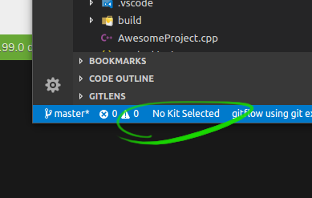
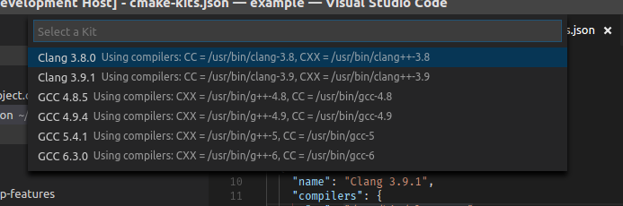
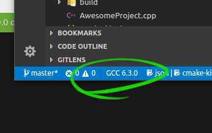
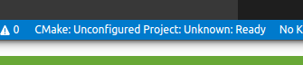
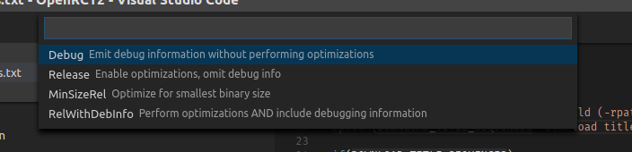
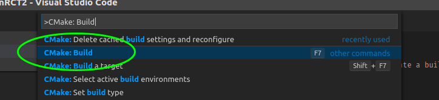
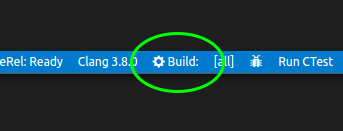
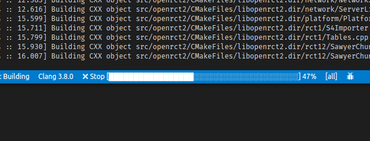

Getting Started
###############

Assuming you already have a CMake project to configure, skip to the
:ref:`configuring` section.

.. _configuring:

Configuring Your Project
************************

Configuring a project is simple, but has two steps before configuration can take
place.

Pre-Configure Steps
===================

Selecting a Kit
---------------

Before we can configure, you must select a *Kit*.

What are kits?
    Kits represent a *toolchain*: A set of compilers, linkers, or other tools
    that will be used to build a project. If you have no Kit selected, CMake
    Tools will start by asking you to select a Kit.

When first opening a project, a status bar item will read **No Kit Selected**:

To select a kit, click this statusbar button, or run the *Select a Kit* command
from the command palette. A quick-pick will appear:

Upon choosing a kit, the statusbar button will display the name of the active
kit:

The chosen kit will be remembered between sessions. Should the availability of
the kit change, the statusbar item may revert and you will be required to select
a kit again.

.. note::
    If you try to configure your project without an active Kit selected, you
    will be prompted to choose one before configuring can proceed.

CMake Tools will use the compilers/toolchain from the kit when building your
project.

Find out more on the :ref:`kits` page.

Selecting a Variant
-------------------

Similar to selecting a kit, we must select a *Variant*.

What are variants?
    Variants represent a set of common compilation options that change the type
    of binaries that will be emitted. This includes Debug, Release, MinSizeRel,
    etc.

To select a variant, click this statusbar button, or run the *Set build type*
command from the command palette. A quick-pick will appear:

The active build variant will be displayed on the same statusbar button, along
with the project name and extension status.

CMake Tools will load up the default variant when it doesn't detect a prior
selection. For the default variant, this will be ``Debug``.

Find out more on the :ref:`variants` page.

Running Configuration
=====================

Configuration can be run by clicking the project button in the statusbar and
changing the build type, by running the *CMake: Configure* command from the
command palette, or by running a build when configuration has not yet taken
place.

When configuration runs, the *CMake/Build* output panel will reveal and show
the live output from CMake as configuration runs:

.. image:: res/configure_output.png
    :align: center

At this point, CMake Tools has loaded information about your project and you are
free to roam about the cabin.

Building Your Project
*********************

More important than just configuring, you probably want to *build* your project
as well.

Building is simple: Run the *CMake: Build* command from the command palette:

.. note:: The default keybinding for this command is ``F7``.

You can also press the *Build* button in the statusbar:

While the the build is running, the *Build* button will be replaced with a
build progress bar:

The build can be stopped by clicking the *Stop* button.