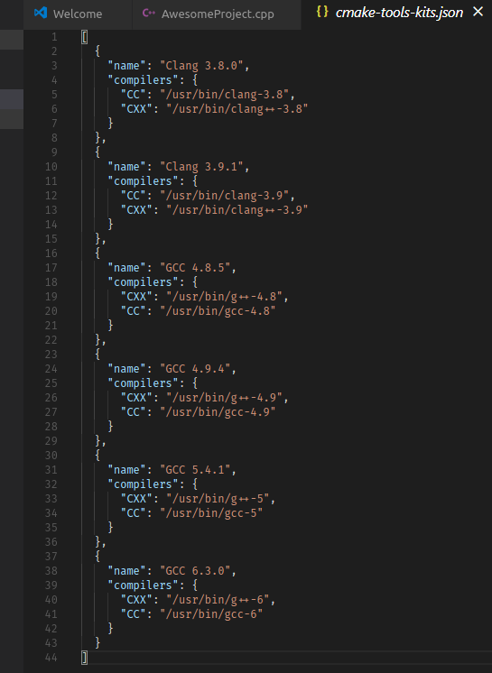

# CMake kits

A _kit_ defines project-agnostic and configuration-agnostic info about how to build code. A kit can include:

- A set of compilers: these are locked at specific versions so that you can switch your compiler version quickly and easily.
- A Visual Studio installation: building for Visual Studio involves more than just finding the necessary compiler executable. Visual C++ requires certain environment variables to be set to tell it how to find and link to the Visual C++ toolchain headers and libraries.
- A toolchain file: The low-level way to instruct CMake how to compile and link for a target. CMake Tools handles toolchain files using kits.

Kits are mostly CMake-generator-agnostic (a CMake generator writes the input files for the native build system). Visual Studio kits have a preferred generator that will be used as a fallback to ensure a matching MSBuild and .sln generator are used for the Visual C++ compiler.

> **Note:**
> * If you use the [Ninja](https://ninja-build.org/) build system, don't worry about Visual Studio CMake Generators. CMake Tools will prefer Ninja if it is present, unless configured otherwise.
> * If you change the active kit while a project is configured, the project configuration will be re-generated with the chosen kit.
> * Using a kit is recommended but optional. If you don't use a kit, CMake will perform its own automatic detection.

## How kits are found and defined

When the CMake Tools extension runs for the first time, it will [scan for kits](#scan-for-kits) to find available toolchains. It populates the initial list of kits by looking in directories where known compilers are typically installed, and uses `vswhere` to find Visual Studio installations.

### User-local kits

A user-local kit is a kit that is available to a particular user for all projects open with CMake Tools.

The user-local list of kits is stored in the `cmake-tools-kits.json` file, which you can edit by invoking **Edit User-Local CMake Kits** from the command palette:



You can manually edit this file to define new global kits, however the contents of this file will be automatically updated by CMake Tools during a [scan for kits](#scan-for-kits).

> **Tip:**
> Define a new kit with your desired settings rather than modify kits that the CMake Tools extension creates so that your changes aren't overwritten during the next [scan for kits](#scan-for-kits).

### Project kits

Default user-local kits are available for all projects that use CMake Tools. To define a project-local kit, create a `.vscode/cmake-kits.json` file in the project directory. You manage the contents of this file manually, but CMake Tools will automatically reload and refresh when it sees this file added, removed, or changed. When changing kits, you can select from both user-local and project-local kits.

An example of when a project-local kit is useful is when the project defines its own CMake toolchain file(s). A [toolchain kit](#specify-a-toolchain) can be defined that specifies this file to be loaded. You can commit the `.vscode/cmake-kits.json` to source control and share it with other developers for easier collaboration using the named toolchain.

### Scan for kits

Update [user-local kits](#user-local-kits) by running **Scan for Kits** from the VS Code command palette. The following process is used to find available kits:

**1. Search the current PATH for compilers**

 - CMake tools uses the `PATH` environment variable to get a list of directories where compilers can be found.
 - CMake Tools looks for `gcc` and `clang` binaries on the `PATH` and gets version information from each executable it finds. For `gcc`, if a corresponding `g++` executable resides in the same directory it is added to the kit as the corresponding C++ compiler. The same applies for a `clang++` binary in the directory of a `clang` executable.
 
> **Note:**
> CMake Tools only automatically detects `Clang` and `GCC`. If you'd like auto-detection for more tools, please [open a Github issue](https://github.com/microsoft/vscode-cmake-tools/issues) with information about the compiler binary names and how to parse its version information.

**2. Find Visual Studio installations**

- CMake tools includes `vswhere.exe`, which it uses to find Visual Studio instances installed on the system.
 
- For each of `x86`, `amd64`, `x86_amd64`, `x86_arm`, `x86_arm64`, `amd64_x86`, `amd64_arm`, and `amd64_arm64`, CMake Tools checks for installed Visual C++ environments. A kit is generated for each existing MSVC toolchain that is found.

**3. Save results to the user-local kits file**

- The [user-local kit](#user-local-kits) `cmake-tools-kits.json` file is updated with the new kit information.

> **Warning:**
> The name of each kit is generated from the kit compiler and version information. Kits with the same name will be overwritten. To prevent custom kits from being overwritten, give them unique names. CMake Tools will not delete entries from `cmake-tools-kits.json`. It only adds and updates existing ones.

## Kit options

CMake defines different options that can be specified for each kit in their definition in `cmake-tools-kits.json` (user-local) or `.vscode/cmake-kits.json` (project-level), and these options can be mixed-and-matched as needed. For example, a single kit may request a Visual Studio environment, while specifying `clang-cl` as a compiler.

See [Configure CMake](configure.md) for more information about how kits are applied during configuration.

### Specify a compiler

To specify a compiler, list the path to the compiler in the `cmake-tools-kits.json` or `.vscode/cmake-kits.json` file.

The most common CMake languages are `C` and `CXX`, and CMake Tools has built-in support for finding these. However, any language can be specified:

```json
[
    {
        "name": "My Compiler Kit",
        "compilers": {
            "C": "/usr/bin/gcc",
            "CXX": "/usr/bin/g++",
            "Fortran": "/usr/bin/gfortran"
        }
    }
]
```

### Specify a toolchain

CMake Tools doesn't automatically detect toolchains, but you can specify a CMake toolchain file in a kit, like this:

```json
[
    {
        "name": "Emscripten",
        "toolchainFile": "/path/to/emscripten/toolchain.cmake"
    }
]
```

CMake Tools will pass this path for `CMAKE_TOOLCHAIN_FILE` during configuration.

### Visual Studio

CMake Tools automatically sets up the environment for working with Visual C++. It is best to let CMake Tools generate the kits first, then duplicate and modify them:

```json
[
    {
        "name": "A Visual Studio",
        "visualStudio": "Visual Studio Build Tools 2017",
        "visualStudioArchitecture": "amd64"
    }
]
```

Keys:
> `visualStudio` : the name of a Visual Studio installation obtained by `VSWhere`.\
> `visualStudioArchitecture`: the Visual Studio target architecture that would be passed to the `vcvarsall.bat` file when entering the VS dev environment.

> **Note:**
> To use Visual C++, both `visualStudio` and `visualStudioArchitecture` must be specified. Omitting either one won't work.

## Unsupported commands

The following commands are not supported when kits and variants are active:
- **CMake: Scan for Compilers**
- **CMake: Add Configure Preset**
- **CMake: Add Build Preset**
- **CMake: Add Test Preset**
- **CMake: Add Package Preset**
- **CMake: Add Workflow Preset**
- **CMake: Select Configure Preset**
- **CMake: Select Build Preset**
- **CMake: Select Test Preset**
- **CMake: Select Package Preset**
- **CMake: Select Workflow Preset**

### General options

The following additional options may be specified:

`preferredGenerator`

> The CMake generator that should be used with this kit if not the default. CMake Tools will still search in `cmake.preferredGenerators` from `settings.json`, but will fall back to this option if no generator from the user settings is available

`cmakeSettings`

> A JSON object passed as a list of cache settings when running CMake configure. Don't use this for project-specific settings and options. Instead, use `settings.json` for that purpose.

> This setting is most useful when the toolchain file respects additional options that can be passed as cache variables.

`environmentVariables`

> A JSON object of key-value pairs specifying additional environment variables to be defined when using this kit.

`environmentSetupScript`

> The absolute path to a script that modifies/adds environment variables for the kit. Uses `call` on Windows and `source` in `bash` otherwise.

`description`

> A short description of the kit, which will appear next to its name in the selection menu.

## Next steps

- Explore the [CMake Tools documentation](README.md)
