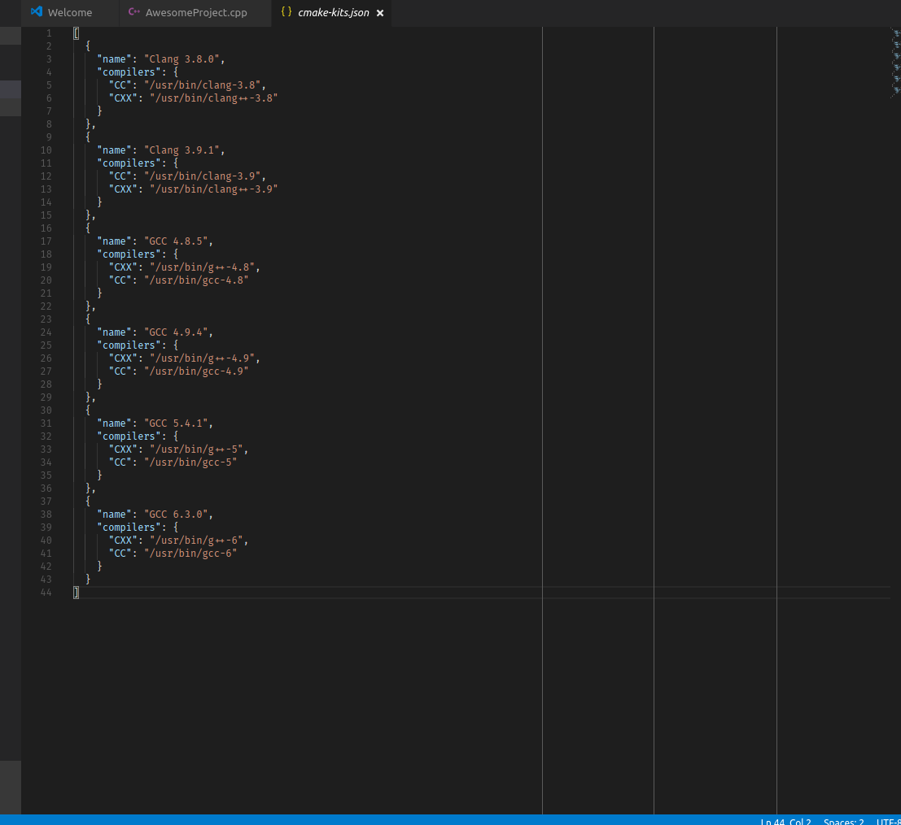

.. _kits:

CMake Kits
##########

A *kit* encompasses project-agnostic and configuration-agnostic information
about how to build code. A kit can include:

- *A set of compilers for some set of languages* - These are locked at specific
  versions such that you can switch your compiler version quickly and easily.
- *A Visual Studio installation* - Building for VS is more complicated than
  simply finding the necessary compiler executable. Visual C++ requires certain
  environment variables to be set to tell it how to find and link to the
  Visual C++ toolchain headers and libraries.
- *A toolchain file* - This is the lowest-level way to instruct CMake how to
  compile and link for a target. CMake Tools handles toolchain files using
  kits.

Kits are mostly CMake-generator-agnostic, although Visual Studio kits will have
a "preferred" generator that will be used as a fallback to ensure a matching
MSBuild and .sln generator is used for the Visual C++ compiler.

.. note::
    If you use `Ninja <https://ninja-build.org/>`_ there is no need to worry
    about Visual Studio CMake Generators. CMake Tools will prefer Ninja if it is
    present unless configured otherwise.

.. note::
    If you change the active Kit while a project is configured, the project
    configuration will be re-generated with the chosen kit.

.. note::
    Using a kit is recommended but optional. Opting-out of using kits will
    cause CMake to perform its own automatic detection.

How Are Kits Found and Defined?
===============================

Upon first startup, CMake Tools will :ref:`scan the system <kit-scan>` for
available toolchains. It looks in certain directories for the presence of
compilers or Visual Studio installations (using ``vswhere``) to populate the
initial list of Kits.

.. _user-local-kits:

User-Local Kits
***************

User-local kits are kits that are available to a particular user for all
projects open with CMake Tools.

The user-local list of kits is stored in a user-owned file, which you can edit
by invoking *Edit CMake Kits* from the command palette. It will open the
``cmake-kits.json`` file:

This file can be manually modified to define new global kits, and the contents
of this file will also be automatically controlled by CMake Tools via the
:ref:`automated kit scanning <kit-scan>`.

.. warning::
    Don't modify any of the kits that CMake Tools defines itself: It will
    overwrite any modifications during :ref:`kit scanning <kit-scan>`. See
    below for more information.

Project Kits
************

The default user-local kits are available for all projects using CMake Tools
for a user. In addition, one can define project-local kits by creating a
``.vscode/cmake-kits.json`` file in the project directory. The contents of this
file must be managed manually, but CMake Tools will automatically reload and
refresh when it sees this file added, removed, or changed. When changing kits,
both user-local and project-local kits will be available for selection.

An example usage of project-local kits is if the project defines its own
CMake toolchain file(s). A :ref:`toolchain kit <kits.types.toolchain>` can be defined
that specifies this file to be loaded. The ``.vscode/cmake-kits.json`` file can
be committed to source control and shared with other developers for easier
collaboration on the named toolchain.

.. _kit-scan:

Scanning Process
****************

:ref:`user-local-kits` can be updated by running *Scan for Kits* in the
command palette. The following process occurs to find available kits:

#. **Search the current PATH for compilers**

    CMake tools will use the ``PATH`` environment variable for a list of
    directories where compilers can be found.

    CMake Tools looks for ``gcc`` and ``clang`` binaries and asks each
    executable for version information.

    For gcc, if a corresponding ``g++`` executable resides in the same
    directory it is added to the kit as the corresponding C++ compiler. The
    same applies for a ``clang++`` binary in the directory of a ``clang``
    executable.

    .. note::
        At the moment, CMake Tools will automatically detect *Clang* and
        *GCC* only. If you'd like auto-detection for more tools,
        please open an issue on the GitHub page with information about the
        compiler binary names and how to parse its version information.

#. **Ask VSWhere about Visual Studio installations**

    CMake tools includes a bundled ``vswhere.exe`` which it uses to ask about
    existing Visual Studio instances installed on the system.

    For each of ``x86``, ``amd64``, ``x86_amd64``, ``x86_arm``, ``x86_arm64``,
    ``amd64_x86``, ``amd64_arm``, and ``amd64_arm64``, CMake Tools will check
    // for installed Visual C++ environments.
    // A kit is generated for each existing MSVC toolchain.

#. **Save results to the user-local kits file**

    When finished, the :ref:`user-local <user-local-kits>` ``cmake-kits.json``
    file will be updated with the new kit information.

    .. warning::

        The ``name`` of each kit is generated from the kit compiler
        and version information, and kits with the same name will be
        overwritten in the file.

        To prevent custom kits from being overwritten, give them unique names.
        CMake Tools will not delete entries from ``cmake-kits.json``, only add
        and update existing ones.

.. _kits.types:

Kit Options
===========

CMake defines several different options that can be specified on each kit in
their definition in ``cmake-kits.json``, and these options can be
mixed-and-matched as needed. For example, A single kit may request a
Visual Studio environment while specifying ``clang-cl`` as a compiler.

.. seealso::

    - :ref:`configuring.how` - Explains how kits are applied during configuration

.. _kits.types.compiler:

Compilers
*********

Specifying language compilers is as simple as listing the paths to compilers
for CMake languages.

The most common CMake languages are ``C`` and ``CXX``, and CMake Tools has
built-in support for finding these, but any language can be specified:

.. code:: json

    {
        "name": "My Compiler Kit",
        "compilers": {
            "C": "/usr/bin/gcc",
            "CXX": "/usr/bin/g++",
            "Fortran": "/usr/bin/gfortran"
        }
    }

.. _kits.types.toolchain:

Toolchain
*********

CMake Tools will not automatically detect them, but you can also specify a
CMake toolchain file in a kit:

.. code:: json

    {
        "name": "Emscripten",
        "toolchainFile": "/path/to/emscripten/toolchain.cmake"
    }

CMake Tools will pass this path for ``CMAKE_TOOLCHAIN_FILE`` during configure.

.. _kits.types.vs:

Visual Studio
*************

CMake Tools will automatically setup the environment for working with Visual C++
when you use a Visual Studio code. It is advised to let CMake Tools
generate the kits first, then duplicate them and modify them.

.. code:: json

    {
        "name": "A Visual Studio",
        "visualStudio": "Visual Studio Build Tools 2017",
        "visualStudioArchitecture": "amd64"
    }

The ``visualStudio`` key corresponds to a name of a Visual Studio installation
obtained from VSWhere. The ``visualStudioArchitecture`` key corresponds to a
Visual Studio target architecture that would be passed to the ``vcvarsall.bat``
file when entering the VS dev environment.

.. note::
    To use Visual C++, *both* of ``visualStudio`` and
    ``visualStudioArchitecture`` *must* be specified. Omitting one will not
    work.

.. _kits.common:

Generic Options
***************

In addition to the above options, the following may be specified:

.. _kits.common.preferredGenerator:

``preferredGenerator``
    The CMake generator that should be used with this kit if not the default.
    CMake Tools will still search in ``cmake.preferredGenerators`` from
    ``settings.json``, but will fall back to this option if no generator
    from the user settings is available

.. _kits.common.cmakeSettings:

``cmakeSettings``
    A JSON object that will be passed as a list of cache settings when running
    CMake configure. Don't use this for project-specific settings and options:
    Prefer to use the ``settings.json`` for that purpose.

    This setting is most useful when the toolchain file respects additional
    options that can be passed as cache variables.

``environmentVariables``
    A JSON object of key-value pairs specifying additional environment
    variables to be defined when using this kit.
