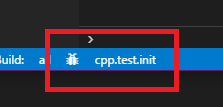

# Target Debugging

Most C and C++ development environments offer some integration with project
configuration that requires awareness of the build system, including the
presence of targets and build artifacts. The experimental Target Debugging
feature offers some such integration with Visual Studio Code for CMake projects
that produce executable targets (including executables used just for testing).

The Target Debugging is meant to make it far simpler for CMake-based projects to
manage their debugging setup within VS Code. There is no need to write a
``launch.json`` file for Target Debugging, and no need to manually specify
the path/architecture/debugger for an executable. All this is determined
automatically by CMake Tools when a target-based debug is invoked.

**NOTE:** CMake Tools extension has enhanced support for using
``ms-vscode.cpptools`` is used for debugging C/C++ programs. If you would like
to use a different debugger extension, you may use integration with
`launch.json` as described below.

## Selecting a Debug Target
Once your project is configured and generated, CMake Tools will automatically
discover the project's executables and the paths to which they are written.
As executable targets are added to the project, CMake Tools will discover them
each time you re-configure the project.

CMake Tools will automatically (re)build an executables target before it
launches the debugger, so there is no need to worry about ensuring the target
is built before debugging.

There are multiple ways of selecting launch target.

### Using status bar

Once a CMake project is opened, the following new entries will appear on the
status bar:

The left-hand button will launch the selected executable target in the debugger.
Initially, the text entry may read ``[No target selected for debugging]``. In
this case, the project may need to be configured again to generate the metadata.
Clicking right-hand button will launch a quick-pick to select a launch target.

### Using command palette

Another option is to bring up the Command Palette (``Ctrl+Shift+P`` or `F1`) and
select use ``Select a Target to Debug``:

Once target is selected you may also use commands to start it with
or without debugging:

 * ``Debug Target``
 * ``Execute the current target without a debugger``

## Advanced usage

### Configuring the debugger

CMake Tools generates a debugging configuration object on-the-fly when
debugging is requested. To set some additional parameters to this debug
configuration, use the ``cmake.debugConfig``. Under the hood, CMake Tools
delegates to Microsoft's C and C++ extension to do debugging, so all options
listed [here](https://github.com/Microsoft/vscode-cpptools/blob/master/launch.md)
are available. CMake Tools will fill all required options for you, so you don't
need to specify any of the required options outlined in the help document.

### Running program from ``launch.json``
In some cases debugging support provided by CMake Tools may be limited or incorrect.
It is possible to use CMake Tools from ``launch.json`` to fill in information
about executables and their paths.

Basic ``launch.json`` configuration may look like this:

~~~json
{
    "version": "0.2.0",
    "configurations": [
        {
            "name": "Launch CMake-built program",
            "type": "cppdbg",
            "request": "launch",
            "program": "${command:cmake.launchTargetProgramPath}",
            "stopAtEntry": true,
            "cwd": "${workspaceRoot}"
        }
    ]
}
~~~

This uses the `${command:...}` syntax to tell VSCode that it should call the
named extension command to fill in the respective value.

In the above example, `program` will be filled out to the path of the active
launch target, similar to using the debugging command from CMake Tools.

A few notes:

* Use ``"type": "cppvsdbg"`` if you use Visual Studio compiler.
* Use ``"program": "${command:cmake.selectLaunchTarget}"`` to pick a new
  target each time you wish to debug.

Please refer to VS Code documentation for more information about debugging and
`launch.json`

**NOTE:** If using `launch.json`: due to current limitations of VS Code it is
not possible to specify a ``preLaunchTask`` which invokes build via CMake Tools
commands, so you must build the desired target before debugging.

# Enabling Target Debugging for CMake versions < 3.7.2
Modern CMake versions provide support for querying information about a project
being configured without any modifications to the project itself.

To achieve this for older versions, CMake Tools will emit a CMake module which
can be easily included in any CMake project by adding the following line at the
top of the ``CMakeLists.txt`` file, before calling any
``add_library`` or ``add_executable``:

~~~cmake
include(CMakeToolsHelpers OPTIONAL)
~~~

The keyword ``OPTIONAL`` here means that CMake won't complain if it fails to
find the module. This is very useful, as the script itself isn't important to
the build system. As such, this line can be committed to the project and no
users will ever have to care about its presence.

## Troubleshooting

### Q: CMake isn't finding the `CMakeToolsHelpers` script! Why is this?

**A:** There are a few primary reasons why CMake might not find it. CMake Tools
sets `CMAKE_MODULE_PATH` such that CMake will be able to find the generated
helper module. This means that A) CMake will only find this module if it was
invoked using CMake Tools within Visual Studio Code and B) destructive
modifications of `CMAKE_MODULE_PATH` before the `include` line can cause CMake
to not find the module. In the **B** case: *instead* of writing:

~~~cmake
set(CMAKE_MODULE_PATH foo)
~~~

write this:

~~~cmake
list(APPEND CMAKE_MODULE_PATH foo)
~~~

This will append a directory to the module path instead of wiping it out
completely.

### Q: When I `include(CMakeToolsHelpers)`, `add_executable` makes CMake crash!

**A:** If you run into this issue, you probably know exactly why this happens.
This is a known issue with the way CMake provides command hook functionality.
Unfortunately, there's no good way to work around it without upgrading to
CMake 3.7.2 or newer.