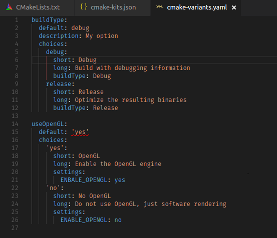
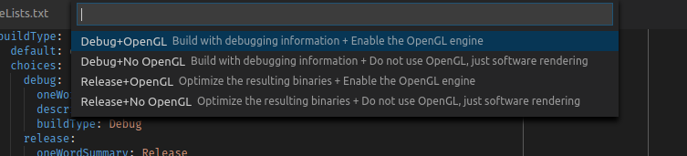
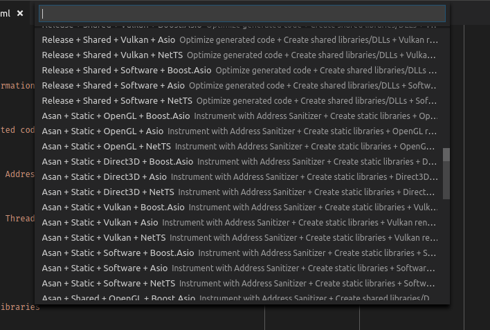

# CMake variants

CMake Tools introduces the concept of _CMake variants_, which are a way to group together and combine a common set of build options and give them a name.

The main way to create a variant is via a `cmake-variants.json` or `cmake-variants.yaml` file.

Variants are a different concept than toolchains or toolsets. Those are handled by [CMake kits](kits.md).

By default, if a variants file isn't present, CMake Tools loads five options. Four options are variants that correspond to the default CMake build types: **Release**, **Debug**, **MinSizeRel**, and **RelWithDebInfo**. One **Unspecified** option lets CMake select the build type itself. The options do the following:

| Option | Description |
|---------|---------|
| `Debug` | Variant - Disables optimizations and includes debug info. |
| `Release` | Variant - Includes optimizations but no debug info. |
| `MinSizeRel` | Variant - Optimizes for size. No debug info. |
| `RelWithDebInfo`  | Variant - Optimizes for speed but also includes debug info. |
| `Unspecified` | Lets CMake select a default build type. |

Selecting one of the variants configures and builds using the corresponding build type.

> **Important:**
> CMake Tools does not respect `CMAKE_CONFIGURATION_TYPES`. Only the default configuration types listed above are present. A custom variant file is required to load other build types.

For smaller projects, you don't need to provide a custom `cmake-variants.yaml` file. The default CMake build types work fine.

Large projects with more complex configuration options can specify additional build variants.

The variants file can be placed either in the root of the project directory, or in the project's `.vscode` subdirectory.

> **Note:**
> CMake Tools provides a YAML validation schema, but it is only checked in the editor when using the **YAML Support by Red Hat** extension.

You can use either `cmake-variants.json` or `cmake-variants.yaml` with the same result. The examples here use the YAML format, but can also be defined in JSON.

## Example YAML variants file

A simple two-setting `cmake-variants.yaml` might look like this:



This file defines two variant settings: `buildType` and `useOpenGL`. Each has two options defined by `choices`. A combination of options, from a set of settings, forms a variant.

In total, the number of possible variants is defined by the cartesian product of possible choices. For example, two settings, each with two options, creates four variants. When you change the build type, CMake Tools will present the possible combinations in a quick pick list:



When a `cmake-variants.json` or `cmake-variants.yaml` file is present, the options they define replace the default set of variants. This allows a project owner to define their own set of common build configurations, which can be distributed to others.

## Variant schema

The root of the variants must be an object, where each key represents a variant option. In the example above, a `buildType` option is defined for the kind of `CMAKE_BUILD_TYPE` we want. It also exposes `useOpenGL` which controls the `ENABLE_OPENGL` CMake option.

### Variant settings

Each setting in the variant is an object that may have the following keys:

|Key  | Description  |
|---------|---------|
|`default` |  A string to set as the default choice for the variant option. The string here must correspond to an option from `choices`. |
|`description`|  An optional string that describes what the option controls. CMake Tools ignores this string.|
|`choices` | A mapping of possible options for the setting. A variant setting can have an arbitrary number of options. The next section describes options. |

### Variant options

Variant options appear under the `choices`key for a variant setting. Each is required to have an unique name, but the name itself is unimportant to CMake Tools.

A choice may specify any of the following options, but must include the `short` option:

|Option  |Description  |
|---------|---------|
|`short`|  A short human-readable string describing the option. |
|`long (Optional)` | A lengthier human-readable string describing the option. |
|`buildType (Optional)` |  An optional string to set for `CMAKE_BUILD_TYPE` when the option is active. |
|`linkage (Optional)` |  Either `static` or `shared`. Sets the value of `CMAKE_BUILD_SHARED_LIBS`. |
|`settings (Optional)` | A map of arbitrary CMake cache options to pass via the CMake command line with `-D`. Similar to the `cmake.configureSettings` in `settings.json`. |
|`env (Optional)` | A map of key-value string pairs specifying additional environment variables to set during CMake _configure_ (not build). These environment variables take precedence over environment variables from `settings.json`, the current [CMake kit](kits.md), and environment variables set by the system. |

The options above are only valid under entries in the `choices` map.

## How variants are applied

A variant is a specific combination of one option from each setting. When CMake Tools executes the configure step, it uses the values from the currently active variant to determine the values to pass to the CMake process, as follows:

1. Properties from all active options are merged. For `env` and `settings`, the objects themselves are merged. The merge order isn't specified, so conflicting properties in options will result in unspecified behavior.

1. All `settings` from the chosen options are passed as `-D` arguments to the CMake process.

1. The `buildType` is used for `CMAKE_BUILD_TYPE`, the `--config` flag for the build (for multi-configuration generators), and for the CTest `--config` flag.

1. If `linkage` is `true`, `BUILD_SHARED_LIBS` is set to `ON`. If `linkage` is `false`, `BUILD_SHARED_LIBS` is set to `OFF`. If not specified, `BUILD_SHARED_LIBS` isn't set on the CMake command line.

1. The environment variables from `env` are set for the CMake process.

## Large variant file example

Given the following variants file:

```yaml
    buildType:
      default: debug
      choices:
        debug:
          short: Debug
          long: Emit debug information
          buildType: Debug
        release:
          short: Release
          long: Optimize generated code
          buildType: Release
        asan:
          short: Asan
          long: Instrument with Address Sanitizer
          buildType: Asan
        tsan:
          short: Tsan
          long: Instrument with Thread Sanitizer
          buildType: Tsan

    linkage:
      default: static
      choices:
        static:
          short: Static
          long: Create static libraries
          linkage: static
        shared:
          short: Shared
          long: Create shared libraries/DLLs
          linkage: shared

    engine:
      default: ogl
      choices:
        ogl:
          short: OpenGL
          long: OpenGL rendering
          settings:
            ENGINE: OpenGL
        d3d:
          short: Direct3D
          long: Direct3D rendering
          settings:
            ENGINE: Direct3D
        vulkan:
          short: Vulkan
          long: Vulkan rendering
          settings:
            ENGINE: Vulkan
        software:
          short: Software
          long: Software rendering
          settings:
            ENGINE: Software

    network:
      default: boost
      choices:
        boost:
          short: Boost.Asio
          long: Use Boost.Asio for networking
          settings:
            NETWORK: Boost
        asio:
          short: Asio
          long: Use standalone-Asio for networking
          settings:
            NETWORK: Asio
        net-ts:
          short: NetTS
          long: Use the C++ Networking TS for networking
          settings:
            NETWORK: net-ts
```

CMake Tools will present the cartesian product of all options. For the example above, it will produce 4 × 2 × 4 × 3 = 96 different variants:



This example creates many possible variants, but may not be unreasonable if you are building complex software. CMake Tools shows all of the possible combinations, and persists your selection between sessions.
