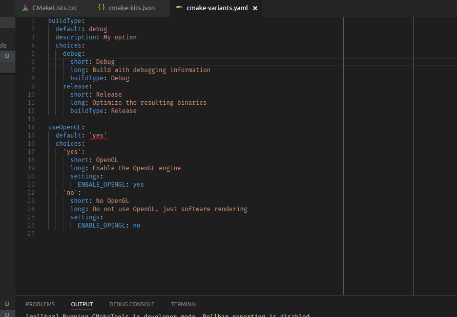
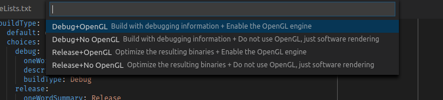

.. _variants:

CMake Variants
##############

CMake Tools introduces the concept of *CMake Variants*, a way to group together
and combine a common set of build options and give them a useful name. The main
interface for creating and building variants is ``cmake-variants.json``, or
``cmake-variants.yaml``.

For smaller or simple projects, providing a custom ``cmake-variants.yaml`` is
unnecessary, and the default CMake build types will work just fine.

The variants file can be placed in the root of the project directory, or in the
``.vscode`` subdirectory for the project.

.. note::

    CMake Tools provides a YAML validation schema, which is only checked in the
    editor when using the *YAML Support by Red Hat* extension.

    You can use either ``cmake-variants.json`` or ``cmake-variants.yaml``. Both
    will have the same end result.

    The examples in this page will use the YAML format, but everything can be
    done in the JSON format as well.

What does it look like?
=======================

A simple two-option ``cmake-variants.yaml`` might look like this:

This file defines two variant options: *buildType* and *useOpenGL*. They each
have two settings of their own, defined by the ``choices`` key.

In total, the number of possible variants is defined by the cartesian product
of the possible choices. Two options with two settings each creates *four*
variants. When we ask to change the build type, CMake Tools will present each
possible combination in a quickpick:

When a ``cmake-variants.json`` or ``cmake-variants.yaml`` file is present, the
options defined therein will replace the default set of variants CMake Tools
would otherwise present. This allows a project owner to define their own set of
common build configurations that can be distributed downstream.

The Variant Schema
==================

The root of the variants must be an object, where each key represents a
tweakable variant option. In the example above, we expose a ``buildType`` option
for what kind of ``CMAKE_BUILD_TYPE`` we want. We also expose a ``useOpenGL``
boolean option.

Variant Settings
****************

Each *setting* in the variant is also an object, with the following keys:

``default``
    A string to set as the default value for the variant option. The string here
    must correspond with an option from ``choices``

``description``
    An optional string to describe what the option controls. CMake Tools ignores
    this string.

``choices``
    A mapping of possible options for the setting. A variant setting can have an
    arbitrary number of possible options. See the section below on options.

Variant Options
***************

Variant options appear under the ``choices`` key for a variant setting. Each is
required to have an unique name, but the name itself is unimportant to CMake
Tools.

The option is itself a map with the following keys:

``short``
    A short human-readable string to describe the option.

``long``
    A lengthier human-readable string to describe the option. This value is
    optional.

``buildType``
    An optional string to set for ``CMAKE_BUILD_TYPE`` when the option is
    active.

``linkage``
    Either ``static`` or ``shared``. Sets the value of
    ``CMAKE_BUILD_SHARED_LIBS``. This value is optional.

``settings``
    A map of arbitrary CMake cache options to pass via the CMake command line
    with ``-D``. Similar to the ``cmake.configureSettings`` in
    ``settings.json``.

``env``
    A map of key-value string pairs specifying additional environment variables
    to set during CMake *configure* (not build). These environment variables
    take precedence over environment variables from ``settings.json``, the
    currently set :ref:`kit <kits>`, and environment variables set by the
    system.